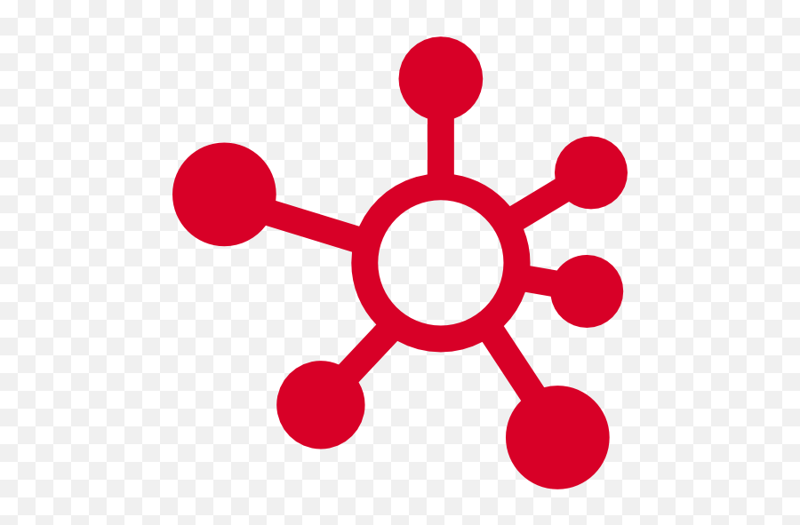

<h1>Phonebook APP</h1>
<h2>Frontend</h2>

This repository is the frontend part of my project and is a simple phonebook web
application. For a quick login use login: <strong>v.rohalov@gmail.com</strong> and password: <strong>Qwerty123!</strong>

<h3>Languages and Tools:</h3>
<ul list-style="none">
    <li>
        <a href="https://react.dev/" target="_blank" rel="noreferrer">
            
            
ReactJS, the official React build was used as the basis

        </a>
    </li>
    <li>
        <a href="https://redux-toolkit.js.org/" target="_blank" rel="noreferrer">
            
            
Redux Toolkit, was used to work with the state

        </a>
    </li>
    <li>
        <a href="https://reactrouter.com/" target="_blank" rel="noreferrer">
            
            
React Router, was used for routing

        </a>
    </li>
    <li>
        <a href="https://axios-http.com/" target="_blank" rel="noreferrer">
            
            
Axios, for server requests

        </a>
    </li>
    <li>
        <a href="https://github.com/rt2zz/redux-persist" target="_blank" rel="noreferrer">
            
            
Redux Persist, for working with Local Storage

        </a>
    </li>
    <li>
        <a href="https://emotion.sh/" target="_blank" rel="noreferrer">
            
            
Emotion Styled, was used to work with styles

        </a>
    </li>
</ul>
